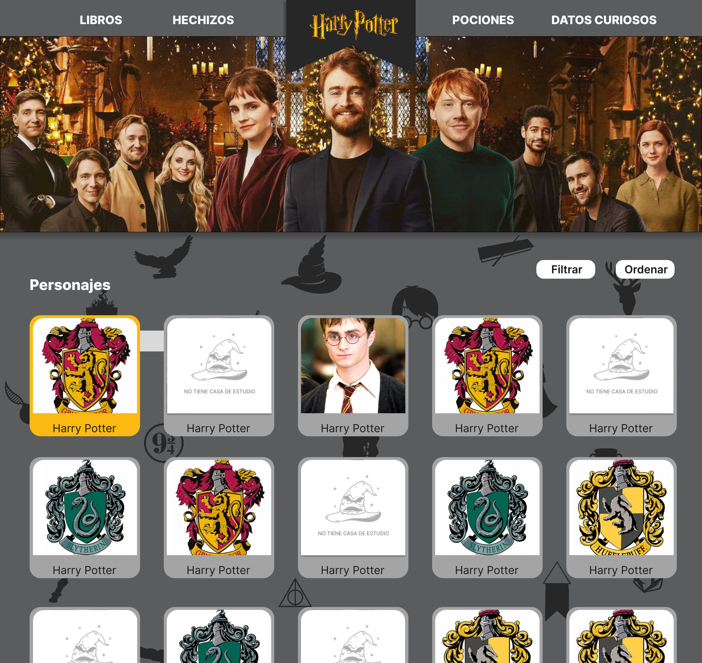

# Data Lovers - HARRY POTTER

## Índice

* [1. Preámbulo](#1-preámbulo)
* [2. Resumen del proyecto](#2-resumen-del-proyecto)
* [3. Historias de usuario](#3-historias-de-usuario)
* [4. Proceso de diseño](#4-proceso-de-diseño)
* [5. Participantes del proyecto](#4-Participantes-del-proyecto)

***

## 1. Preámbulo

Según [Forbes](https://www.forbes.com/sites/bernardmarr/2018/05/21/how-much-data-do-we-create-every-day-the-mind-blowing-stats-everyone-should-read),
el 90% de la data que existe hoy ha sido creada durante los últimos dos años.
Cada día generamos 2.5 millones de terabytes de datos, una cifra sin
precedentes.

No obstante, los datos por sí mismos son de poca utilidad. Para que esas
grandes cantidades de datos se conviertan en **información** fácil de leer para
los usuarios, necesitamos entender y procesar estos datos. Una manera simple de
hacerlo es creando _interfaces_ y _visualizaciones_.

En la actualidad, todas las personas ingresan a varias páginas web cada día,
con diversos fines. Las webs han crecido hasta volverse fundamentales para todo
y son el corazón tecnológico de la humanidad.

## 2. Resumen del proyecto

En este proyecto contruimos una página web donde visualizaremos datos de
la Saga de Peliculas y Libros de Harry Potter. 

La página web construida, logra mostrar data de personajes, libros, datos
curisos, hechizos y pociones, ademas de funciones que ordenan los personajes
 de A a la Z y viceversa, al igual de poder filtrar por categorias (Muggles,
humanos, personajes femeninos y personajes masculinos) y calcular un dato extra
 en la sección de datos curiosos que al recordar el 7 de marzo el día Internacional
 de la Mujer quisimos calcular la cantidad de personajes femeninos.

 ### Harry Potter
 
Harry Potter es una serie de novelas fantásticas escrita por la autora
británica J. K. Rowling, en la que se describen las aventuras del joven
aprendiz de magia y hechicería Harry Potter y sus amigos durante los años
que pasan en el Colegio Hogwarts de Magia y Hechicería. El argumento se
centra en la lucha entre Harry Potter y el malvado mago lord Voldemort,
quien asesinó a los padres de Harry en su afán de conquistar el mundo mágico.

El éxito de las novelas ha hecho de la marca una de las más exitosas del mundo.
En 1999, la productora de cine Warner Bros. Adquirió los derechos para
adaptar los siete libros a una serie de películas. La última de ellas,
Harry Potter y las reliquias de la Muerte: parte 2, se estrenó el 15 de julio
de 2011 y con ocho películas realizadas la serie se convirtió en una de las
franquicias más exitosas del cine en concepto de recaudaciones en taquilla.​

## 3. Historias de usuario

Las siguientes descripciones muestran la perspectiva de nuestro usuario. 

### Usuario
Personas de 18 a 40 años de edad, con conocimientos de busqueda por internet,
fan de las sagas de Harry Potter y con deseo de ingrementar sus conocimiento sobre la saga. 

  * HU 1. Yo como fan de Harry Potter quiero ver a todos personajes para tener la información de ellos.
  * HU 2. Yo como fan deseo filtrar los personajes por especies para reconocerlos facilmente.
  * HU 3. Yo como fan deseo seleccionar a mis personajes por su casa de estudio para saber cuantos estudiantes eran por cada casa.
  * HU 4. Yo como fan deseo saber cuantos libros tiene la saga de Harry Potter para comparar con mi biblioteca actual.
  * HU 5. Yo como fan deseo saber que tipos de hechizos existen para utilizarlos en algún juego.
  * HU 6. Yo como fan deseo saber que tipo de pociones existen para incrementar mis conocimientos en los personajes.
  * HU 7. Yo como fan deseo saber los datos curiosos de la saga de Harry Potter para tener más datos que otros Harry Lovers.

## 4. Proceso de diseño

El proceso de creación de la página web se guió a traves de las historias de usuarios creadas, 
de una persperctiva que nuestro usuario pueda navegar con facilidad. 

En la siguiente imagen, se visualiza el prototipo de baja fidelidad, visiones iniciales
de nuestro producto. 

Y esta imagen, muestra el prototipo de alta fidelidad, semejandose a la vista real que se logro crear. 

## 5. Participantes del proyecto

 * [Laura Cecilia Montero Martinez](https://github.com/LauraCMonteroM),
 * [Claudia Ortiz Llamoca](https://github.com/ClauOrtiiz).

